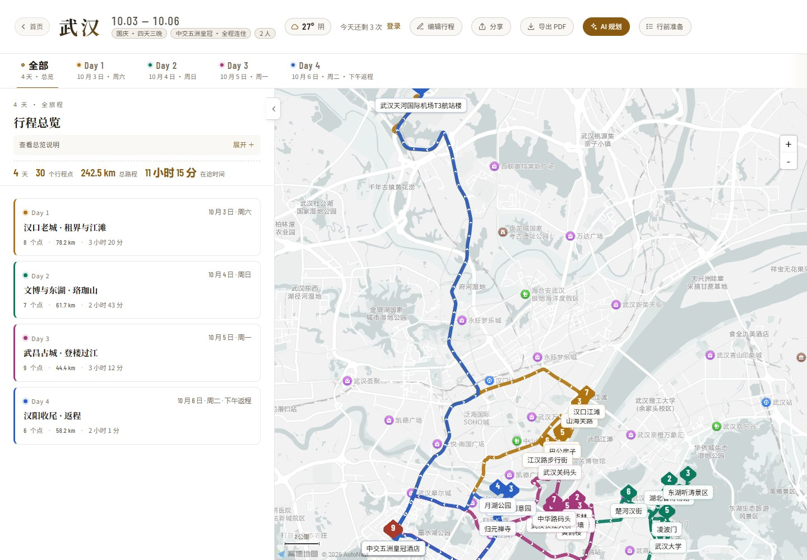
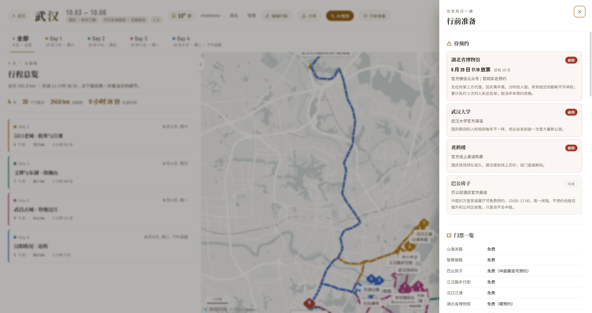
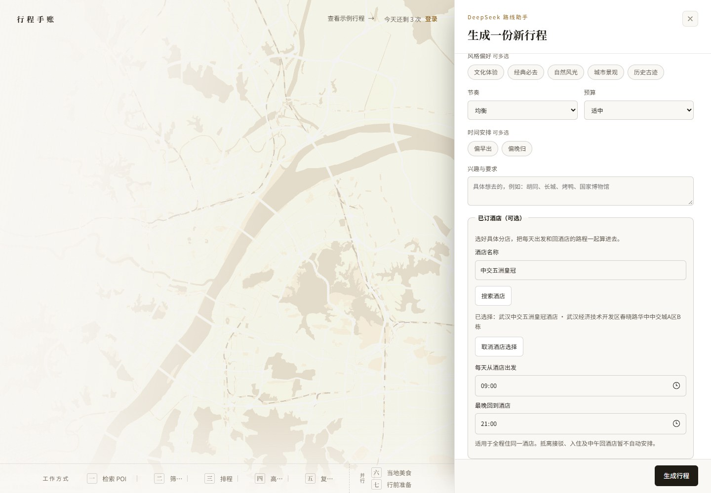
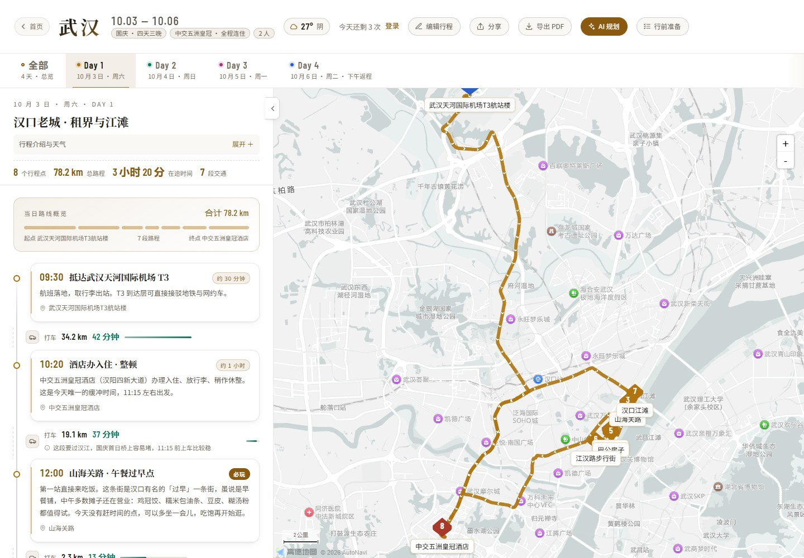
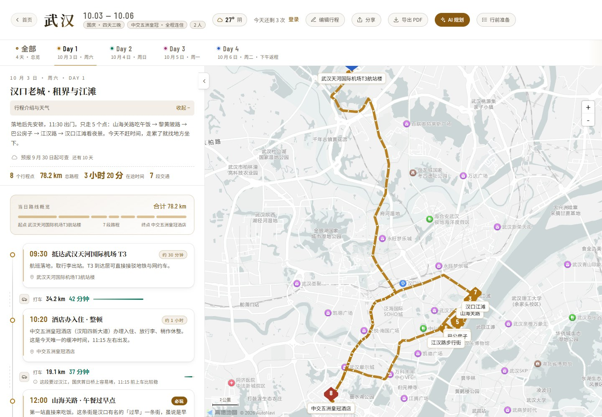
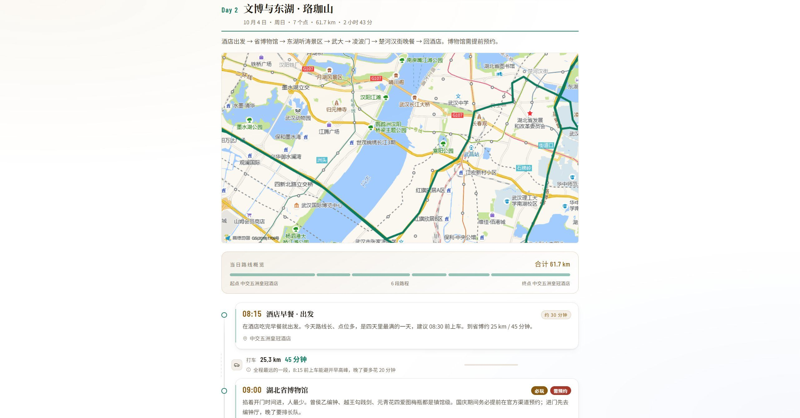

<div align="center">

# Smart Trip Planner

**智能行程规划** —— 六个 Agent 接力，把一座城市做成一份走得通的行程

高德实时检索 → 筛选候选 → 排程 → 真实算路 → 检查与审校修复 → 当地美食 / 行前准备


</div>

## 目录

- [界面预览](#界面预览)
- [快速开始](#快速开始)
- [项目结构](#项目结构)
- [AI 行程规划](#ai-行程规划)
- [编辑行程](#编辑行程)
- [界面与交互](#界面与交互)
- [账号与权限](#账号与权限)
- [密钥与安全](#密钥与安全)
- [数据库](#数据库)
- [部署](#部署)
- [开发与维护](#开发与维护)
- [License](#license)

## 界面预览


> 静置的高德路网底图（去掉标注与交互）+ 墨绘演示：候选点依次落下、连成路线、
> 落一枚朱砂印章。底部那排节点是六个 Agent 与两步纯高德工具，末尾画成**分叉**
> 是因为「当地美食」与「行前准备」确实并行。
>
> 仓库内置一份写好的**武汉四天示例行程**，点「先看看示例」随时可看。



> 默认进入总览：查看每天的地点、路程与在途时间，每天各有主题色；
> 左栏列出每天的点数、路程与在途时间。点左栏任意一天，才进到当天的细节。

展开「行前准备」，是这一趟专属的待预约、门票、交通结论与打包清单：



> 行前准备以右侧抽屉展示，可随时关闭并回到当前行程。

已订酒店可搜索并选择具体分店，设置每日出发和最晚返回时间：



查看某一天时，介绍与天气默认收起，把更多空间留给时间轴；需要时点击展开：





时间或开放风险以胶囊提示单独展示，不随介绍一起隐藏。顶部「导出 PDF」采用统一胶囊按钮。
以上页面截图使用内置示例与真实酒店搜索；不代表新生成行程已通过所有校验。

## 快速开始

### 环境要求

| 项 | 要求 |
|---|---|
| Node | ≥ 22（用到内置的 `node:sqlite` 做一次性导出） |
| MySQL | 8.0+（本地开发；线上不依赖） |
| 依赖 | 只有 `mysql2` 一个，`npm install` 即可 |

### 首次启动

```powershell
npm install                                  # 只有一个依赖：mysql2
Copy-Item config.local.example.js config.local.js  # Windows；然后填写密钥和数据库口令
mysql -u root -p -e "CREATE DATABASE itinerary DEFAULT CHARACTER SET utf8mb4 COLLATE utf8mb4_0900_ai_ci;"
npm start                                    # 打开 http://localhost:5173
```

首页是 `/`，行程页是 `/trip.html`。

密钥与数据库口令填在由 `config.local.example.js` 复制出的 `config.local.js` 里。这个文件**不部署、不入库**，
`.gitignore` 与 `.vercelignore` 双重排除，`serve.js` 也拒绝把它当静态文件发出。

`APP_SECRET` 只从环境变量读取，不要写入配置文件。它用于加密用户自配的 DeepSeek 密钥；以后重启时必须继续使用同一个值，
否则已有密文无法解开。已有配置时请复用，不能每次启动重新生成。
Windows 用户环境变量已保存该值、但当前终端尚未刷新时，可在 `npm start` 前执行：

```powershell
$env:APP_SECRET = [Environment]::GetEnvironmentVariable('APP_SECRET', 'User')
```

首次配置可用 `node -e "console.log(require('crypto').randomBytes(32).toString('hex'))"`
生成随机值，保存到部署环境的密钥配置或本机用户环境变量中；不要提交到 Git。

首次启动会自动创建空库中的表。仓库内置的武汉示例行程可直接浏览，无需导入数据库备份。
`database.sql` 含用户口令散列，不随仓库提供；恢复既有账号和行程时才需要自己的安全备份。

在 macOS、Linux 或 Git Bash 中，可用 `cp config.local.example.js config.local.js` 完成复制。

> **不要用 `file://` 直接双击 `index.html`。** 密钥移出浏览器之后，算路与天气
> 必须经同源的 `/api/amap` 转发，而 `file://` 下不存在同源后端 ——
> 地图底图还能出来，但路线会退化成示意直线、天气不显示。

### 内置示例行程

| | |
|---|---|
| 抵达 | 10.03 09:30　武汉天河国际机场 T3 |
| 住宿 | 中交五洲皇冠酒店（10.03 入住 · 10.06 退房，共 3 晚） |
| 返程 | 10.06 19:40　武汉天河国际机场 T3 |

天数划分：Day1 = 10.03（周六 · 汉口）、Day2 = 10.04（周日 · 东湖文博）、Day3 = 10.05（周一 · 武昌老城 + 轮渡过江）、Day4 = 10.06（周二 · 汉阳收尾 + 返程）。

> 排期约束：10.05 是周一，湖北省博物馆周一闭馆，所以文博线放在 10.04。
>
> Day3 收尾：晚上从**中华路码头**坐轮渡（武中线，1.5 元）过江到**武汉关码头**，末班 20:00 发船，
> 赶 19:30 那班最稳妥。这一趟本来就顺路，江面上看两岸灯光是全程最值的一段。

## 项目结构

```
config.js                 浏览器侧的密钥与行程元信息（含每日配色 DAY_HUE）
config.local.example.js   本地配置模板（可复制为 config.local.js）
config.local.js           本地私有配置：高德/DeepSeek 密钥 + MySQL 连接（不入库）
index.html                首页 —— 静置底图 + 墨绘 + 阶段管线 + 规划表单
trip.html                 行程页 —— 时间轴 + 地图
login.html                登录 / 注册（注册需邀请码）
account.html              个人账号页（填自己的 DeepSeek 密钥、看今日剩余次数）
admin.html                管理后台（账号、邀请码、密钥、配额、审计）
serve.js                  本地服务：静态文件 + 接口路由表 + /api/amap + /api/plan
database.sql              本地生成的数据库导出（不入库，含口令散列）
package.json              启动与检查命令；运行依赖只有 mysql2

api/
  amap.js                 线上 serverless 转发函数（密钥读环境变量）
  plan.js                 AI 行程规划 serverless 函数（DeepSeek）

data/
  poi.js                  地点字典（坐标由生成器自动回填；含门票/吃食/雨天备选）
  itinerary.js            行程主数据 —— 改动只集中在这里
  prep.js                 行前准备：预约规则、必带物品、应急信息、交通结论
  routes-legs.js          自动生成，勿手改

scripts/                  浏览器侧（无构建步骤，直接 ES module）
  check-project.js        Node 开发工具：语法检查 + 示例数据体检（不由页面加载）
  date.js                 日期工具，weather 与 prep 共用
  route.js                调高德 Web 服务取真实道路路径（含降级）
  weather.js              调高德天气接口取实况与预报（运行期，不落盘）
  map.js                  地图：底图、标记、折线
  timeline.js             时间轴：行程卡片、交通段、路线概览、门票/预约徽标
  prep.js                 行前准备抽屉
  plan-form.js            两个页面共用的表单件：天数提示、选项组取值
  plan-store.js           sessionStorage 交接：首页 → 行程页
  plan-client.js          调 /api/plan 并解析 SSE 进度（两个页面共用）
  drawer.js               抽屉壳：一份面板，行前准备 / 当地美食 / 选点面板各注册一个视图
  editor.js               行程编辑模式：增删点、上下移、改时间、重算路段
  food.js                 当地美食视图（独立 Agent 的产出）
  planner.js              行程页的规划弹层
  hero-map.js             首页底图：惰性加载高德、去标注、禁交互、视野反算、飞到选定城市
  hero-ink.js             首页墨绘：演示循环 + 由阶段事件驱动的实时可视化
  landing-flow.js         首页编排：CTA、表单、提交、跳转
  app.js                  行程页编排：日切换、地图联动、天气渲染、键盘快捷键
  session-bar.js          顶栏的登录态与账号入口
  login.js                登录 / 注册表单
  account.js              个人账号页
  admin.js                管理后台
  runtime-config.js       运行时配置：从 /api/config 取浏览器侧密钥
  export-pdf.js           导出 PDF：构建打印版面（走浏览器打印，不引库）

styles/                   base(令牌) / form / layout / components / prep / map /
                          planner / landing / editor / auth / session / account /
                          admin / print(打印版面，屏幕上不显示)

tools/                    服务端（Node，CommonJS）
  amap-proxy.js           高德转发逻辑，serve.js 与 api/amap.js 共用
  static-map.js           静态地图：把某天的路线渲染成 PNG，供导出 PDF 用
  planner.js              DeepSeek 规划：筛选/排程/审校/美食/行前准备 + 高德算路装配
  schedule-check.js       算路后的时间衔接校验与有限自动顺延
  schedule-check.test.js  时间冲突回归测试（npm test）
  sse.js                  SSE 帧写入器，serve.js 与 api/plan.js 共用
  generate-routes.js      构建期：地理编码 + 批量算路
  check-data.js           构建期：数据体检（含天数与配色断言）

  api-router.js           接口路由表（二十几个接口，serve.js 挂载）
  db.js                   数据层：MySQL 连接池、事务、迁移机制
  db-config.js            连接参数解析（环境变量 > config.local.js > 内置默认值）
  schema-mysql.js         建表语句与迁移数组 —— **DDL 的唯一真相源**
  export-sql.js           从旧 SQLite 源库导出 database.sql
  auth.js                 账号、登录流程、失败锁定、请求→用户解析
  sessions.js             会话（库里只存 token 的 sha256）
  user-admin.js           管理员对账号的操作（改角色/禁用/重置口令）
  user-keys.js            用户自配的 DeepSeek 密钥
  settings.js             全局设置表的读写、历史与回滚
  keys.js                 四把密钥的分层解析（env > 数据库 > 本地文件）
  invites.js              邀请码
  quota.js                每日配额（预留 / 结算 / 退回）
  trips.js                行程落库、分享、认领
  audit.js                审计日志
  crypto-box.js           口令散列（scrypt）与密钥信封（AES-256-GCM）
  http.js                 请求解析、响应工具、统一错误出口
  admin-cli.js            管理员命令行（建管理员、发邀请码、看密钥来源）
```

> **每日配色只有一处来源**：`config.js` 的 `DAY_HUE` 数组 + `dayHue(index)`。
> 取色按「第几天」的下标，不按 `day.id` —— AI 产物的 day id 由模型生成，
> 按 id 查表会在 id 格式不合预期时静默塌成同一个颜色。天数上限 14，与调色板等长。

## AI 行程规划

首页点「开始 AI 规划」展开右侧表单；行程页顶栏的「AI 规划」也能就地重新规划。两个入口
共用同一套表单件与接口。

服务端先用高德地点搜索接口按城市实时获取景点候选，再经过**筛选 → 排程 → 真实算路 → 时间检查 → 审校修复**。
发现冲突时，审校结合实测交通耗时调整，再重新算路校验；最多尝试两轮，并受整次规划时间预算约束。
成功路段在同一次请求内复用，变化的路线重新计算。仅接受减少问题且不破坏已通过日期的方案，不能靠缩短保留景点的游览时长、删空一天或延长当天过关。
没有发现规则内的问题时不额外调用修复模型；未解决的问题仍会如实标记。最后跑**当地美食**与**行前准备**两个
Agent。合起来是六个 Agent（另有两步是纯高德工具：检索、算路）。模型只能引用本次搜索返回的地点，
结果只允许结构化 JSON；服务端会校验 `poiId`、出行方式和日期，并按坐标补齐路线数据。
因此输入苏州、三亚等城市时不会复用武汉景点，模型也不会直接生成 HTML 或接触 API 密钥。

### 如何决定每天怎么玩

两个规划入口都支持可选的「已订酒店」：输入名称搜索，核对地址后选择具体分店，并设置每日出发和最晚返回时间。
更换城市或修改搜索词会清除旧选择，避免误用其他城市的酒店；未选择酒店仍可正常规划。
当前支持全程同一酒店，按每日酒店往返安排；入住、退房、机场车站接驳以及中午回酒店暂不自动安排。

服务端通过高德重新核对酒店 ID 与城市，补入每天住宿起终点，再计算「酒店 → 景点 → 酒店」全部路段。
酒店没有游览时长，不参与景点筛选；晚于用户设置的返回时间会标记冲突，不擅自延长当天。
搜索仅提供地点信息，不提供实时房价、房态或预订服务。查询失败时可以重试或不选酒店继续。

规划结合兴趣、旅行节奏、同行人群和抵离安排选择体验，不再限定每天几个景点。
大型景区可以占一天，紧凑的城市漫步也可以包含多个短停点；慢游和亲子出行会保留更多休息空间。
候选来自目标城市的实时地点搜索，重新规划时会替换上一份行程的地点与路线。

模型完成排程后，服务端使用高德返回的主交通方式耗时再次检查相邻两站：
**下一站开始时间 ≥ 上一站开始时间 + 完整停留时长 + 交通耗时 + 转场缓冲**。
交通耗时由秒向上取整到分钟；默认缓冲 10 分钟，慢游、家庭或老人出行为 20 分钟。
时长范围取上限，如「1—2 小时」按 2 小时校验。

若当天后续有空档，系统会顺延冲突的到访时间，保留地点顺序与完整游览时长。
顺延不能超过原定当天结束时间，也不会自动跨到第二天；涉及预约、抵离或开放时段的冲突不会擅自改时刻。
如果已有高德返回的真实公交备选比打车快，系统会尝试替换并重新校验整天，仅在冲突全部解除后同步更新路线和交通方式。
这一步不新增接口请求；用户明确要求交通方式，或家庭、老人出行时不会自动替换，避免忽略步行与换乘负担。
不能可靠修复时，保留原时间，在每日摘要和警告中明确标记待调整，并在返回的 `scheduleCheck` 中记录原因和建议时刻。
不会为了通过校验而缩短游览、凑景点或隐藏冲突。

这个检查验证的是景点之间的时间衔接。它尚不验证实时营业时段、预约库存、用餐时间和机场接驳；
停留时长无法解析、缺少路段或交通使用估算值时都会标记待确认。未来日期的交通状况仍可能变化。

排程和审校使用服务端计算的真实日期与星期，优先避开博物馆、美术馆等的周一闭馆风险。
审校同时收到候选地点名称与类型；最终结果再由程序检查，残留的周一场馆安排会生成 `openingWarnings`，
在每日胶囊提示中展示。它表示尚需核实官方公告，不代表已证实闭馆；节假日也不自动视为开放。

规划结果经 `sessionStorage`（key `trip-plan-v1`）交给行程页，读取时会校验版本、天数与
`poiId` 是否可解析，不合格就整份丢弃并回退到内置行程。刷新行程页仍保持该行程；回首页
重新规划会覆盖它。

### 路线为什么曾经会变成虚线

两个叠加的原因，都不是「网络不好」：

1. **高德出错时返回的是 HTTP 200**：`{"status":"0","info":"CUQPS_HAS_EXCEEDED_THE_LIMIT"}`。
   而 `scripts/route.js` 的 `request()` 只看 HTTP 状态码，于是限流被当成「这条路线不存在」，
   静默降级成一条直线。**用户看到的是一条约等于假的路线，而不是一次失败。**
   现在会认 `status === '0'` 并抛出 `info`，再退避重试两次。
2. **客户端原来是「并发 3、不控速」**：单看一天够保守，但总览一次要取四五天，
   闸门一放开就是十几个请求砸出去。现在与工具链同口径：串行 + 320ms 最小间隔。

另外把两处无声的 `catch(() => [from, to])` 补上了日志 —— 之前逐段降级不留下任何痕迹，
问题一直查不到源头。

**取全了再画**：单日与总览都是等所有段都落定才上屏，中途宁可只有标记没有线，
也不会画出半截或假的路线。总览那几秒会显示「正在规划路线…」的加载态。
只有所有重试都失败时才退回虚线示意，并在地图上明示「未取到真实道路路径」。

### 当地美食 Agent

排在算路之后、行前准备之前。它是**独立的 Agent**：自己的阶段 id（`food`）、自己的提示词、
自己的产出字段（`plan.food`，不塞进 `plan.prep`），界面上也是**独立的入口**——
顶栏「当地美食」按钮打开自己的抽屉，与行前准备并列。两者的视图各自注册到同一个抽屉壳
（`scripts/drawer.js`），壳只有一份；没有美食数据时（内置示例行程）这个入口整颗隐藏。

关键在**按动线推荐**而不是给一份「XX 必吃」——
用户要的是「我 Day 2 下午在文庙一带，那里能吃什么」，不是一张和行程无关的榜单。
所以 `near` 必须落在这次行程走过的地方上，实测潮州那次的概述是：

> 这份清单按你四天在潮州的动线来排：Day1 西湖—牌坊街—广济桥，Day2 开元寺—牌坊街巷内……
> 潮州小吃多集中在牌坊街与古城巷子里，所以大部分条目落在你步行会经过的地方。

另外两条约束是为了不让人白跑：**店名不确定就只写位置描述**，不要编一个具体店名；
价格只给区间。实测产出的 `place` 多是「太平路牌坊街沿街的牛肉丸档」「开元路及周边巷子的粿条面店」
这类位置，而不是看起来精确的店名。

### 行前准备 Agent

行程排完之后还会跑一个 **行前准备 Agent**，把 `data/prep.js` 里那四块
——待预约、必带物品、交通结论、实用信息——按**这一趟**的实际情况重新生成一遍。

它和别的阶段最大的不同是：**产物会直接拿去用**（照着抢票、照着打电话），
所以约束比排程那步硬得多，而且提示词写不下这种保证，真正的兜底在服务端校验里：

| 风险 | 兜底做法 |
|---|---|
| 编造放票时间 | 提示词要求「不确定就把数字留空、写清去哪个官方渠道查」；`sanitizePrep` 里 `advance` 与 `release` 必须成对出现，只给一半就没有放票倒计时 |
| 引用不存在的地点 | `bookings` 的 `poiId` 逐个对照行程校验，对不上的直接丢掉 |
| **编造电话号码** | 这个最危险——用户真的会去打。`stripFabricatedPhone` 扫 value 里的长号码，**不在白名单（110/120/119/122/12301/12308）就整条替换成「出发前查官方渠道」** |
| **门票价格编错** | 价格会被用户当真。`hedgePrice` 检查每条：出现了数字却没有「约 / 左右 / 以官方为准」这类限定词，程序化补上「（以官方为准）」 |

> 门票是高德不提供的数据（它不给票价），只能由模型凭经验估。
> 既然给不出保证，就要求每条都标明是估值 —— 实测产出长这样：
> 「广济桥：收费，约 20 元上下，**以官方为准**」「潮州西湖公园：免费，**以官方公布为准**」。

「定制」体现在它的输入上：喂给它的不只是城市和日期，还有**实测路况**——
每一段的出行方式、距离、耗时，以及标了 `alt` 的段还有另一种方式的对比
（见下），所以交通结论是算出来的不是猜的。打包清单也被要求「每一条都要能说出
为什么是这一趟需要它」，而不是给一份放之四海皆准的通用清单。

> **交通对比数据是专门为它补的**：`makeRoutes` 对「主方式是打车、且距离 ≥1.5 km」
> 的段会再算一次公交。只有够长的打车段才谈得上「打车还是地铁」是个选择，
> 太近的段本来就走过去，补算只是白烧配额。
> 公交算不出来（短途、景区周边很常见）就只留主方式 —— **数据里没有的，
> 不许 Agent 编**。

> **美食与行前准备是并行跑的**。两个都只依赖最终行程，彼此没有先后，
> 并行省下较短那个的时间（实测 33.2s → 26.2s）。管线上的点亮也相应改成
> **逐节点事件驱动**，不再靠位置推断「它之前的都算完成」—— 并行时那种推断
> 会把还在跑的节点误标成已完成。

### 实时进度（SSE）

`/api/plan` 支持两种返回，由客户端决定用哪种：

| 请求 | 返回 |
|---|---|
| `Accept: text/event-stream`（或 `?stream=1`） | SSE，逐个阶段推事件，最后推完整结果 |
| 其它 | 一次性 JSON，**老调用完全不变** |

```
event: stage   data: {"stage":"discover","status":"done","ms":2888,"detail":{"count":60}}
event: result  data: {完整行程 JSON}      ← 终结帧
event: error   data: {"message":"..."}    ← 终结帧
: ping                                     ← 心跳，15 秒一次
```

服务端在 `plan(input, onStage)` 的 7 个阶段边界推事件；`onStage` 一律**作为参数透传**，
不能用模块级变量 —— `serve.js` 是长驻进程，并发规划会串台。

> **降级是正常模式，不是边角情况。** Vercel 某些配置下会把响应整段缓冲并补上
> `Content-Length`，而带 `Content-Length` 的 `text/event-stream` 本身就不合法。
> 所以客户端**按响应的 `content-type` 分支**（不是按请求信号），解析器天然能吃
> 「所有帧挤在最后一坨里到齐」；同时用分块数判断这次有没有真的流起来，
> 没流起来就把五个节点**整体点亮**，绝不伪造逐节点耗时。等待期间界面持续显示
> 「已等待 N 秒」，让等待始终看起来是活的。

`tools/sse.js` 是 serve.js 与 api/plan.js 共用的帧写入器。头部必须带
`Cache-Control: no-store, no-transform` 与 `X-Accel-Buffering: no` ——
`no-transform` 是关键，压缩器正是把 SSE 攒成一坨再发的常见原因。

`plan()` 以 90 秒为整次规划的目标预算。真实算路之后，未解决的时间冲突或开放风险交给审校修复，最多两轮；
每轮重新验证结果，复用同次请求内的成功路段。剩余不足 15 秒时不再启动修复，保留未解决的具体问题；
结果的 `repair.attempts` 记录改进、拒绝、失败或预算不足，`repair.status` 表示规则内的问题是否仍存在。
它不等于官方营业信息已核实。美食和行前准备仅在剩余预算足够时运行。
算路还受自身预算约束，预算耗尽时使用明确标记的估算路线，不能当作实测校验通过。

接口失败时，首页会在表单里显示错误、不跳转；行程页保留原行程并显示错误。

## 编辑行程

### 我的行程与保存修改

首页和行程页顶部的「我的行程」进入独立历史页面 `trips.html`。未登录时先登录，再返回列表；
列表仅展示当前账号拥有的记录，按生成时间从新到旧排列，每页 12 条，可按城市或标题搜索并加载更多。
卡片展示旅行日期、天数、酒店与生成时间；查看记录直接读取数据库，不调用 AI，也不消耗生成额度。
空列表提供开始规划入口，读取失败可重试。登录时已有的匿名行程认领流程保持有效。
卡片上的「删除」需再次确认，只允许删除本人行程；删除无法恢复，已有分享链接同时失效。

编辑已保存的行程后，顶部显示「未保存」，点击「保存修改」写回账号。修改会先保存在本标签页的会话草稿中，
刷新同一份行程可恢复；失败时仍保留草稿。它不是跨设备备份，关闭标签页前应完成保存。
服务端仅允许本人更新，并校验版本，其他页面已保存新版本时拒绝覆盖。手动编辑后的行程不沿用原 AI 校验通过结论。
内置示例没有服务端行程 ID，暂不支持将示例的编辑保存到账号。

历史列表和保存功能需要数据库，适用于本地或自托管服务；原来的无数据库 Vercel 部署不支持这两个接口。

顶栏「编辑行程」进入编辑模式：每个行程点右侧出现 ↑ ↓ ✕，时间戳变成可改的输入框，
当天末尾出现「加个景点」。改动即时重算路段、重画地图，并写回本地会话草稿；
点击「保存修改」后才会同步到账号，供下次或其他设备打开。

**备选景点**来自这次检索的**全部**结果，不只是排进行程的那些。服务端的 `plan.poi`
从「只保留用到的点」改成「全量保留」，并标出哪些进过筛选 Agent 的候选（`picked`）——
候选面板把带「推荐」的排在前面，其余算「检索到了但没被看中」。没有这个池子，
编辑模式就无点可加。

两条设计取向：

- **不上拖拽**。触屏上拖拽和页面滚动打架，而一天也就五六个点 —— 点两下箭头比拖一次更快，
  也更难误操作。「加个景点」也放在当天**末尾**而不是每个缝隙都插一个入口：
  加进来再上移，比瞄准「插在第 3 个点之后」轻松。
- **顺序改了，时间跟着位置重排**。把一个点从第三位移到第一位时，时间跟**位置**走而不是
  跟那个点走 —— 否则会读成「第一个点 14:00、第二个点 09:30」。顺序变了、时刻表仍然是
  从早到晚的。

> **路段必须整段重算**：增删一个点会让它之后所有点的 `fromIndex` 全部前移，
> 旧路段整批对不上号。一天五六个点，全部重来比维护「哪些对还成立」简单得多。
> 重算时按「每一对相邻点」单独取路（路段卡片要逐段的距离耗时），取完把折线
> **塞进地图那套缓存**（`TripRoute.seed`）—— 不接上的话地图会按出行方式分组再取一遍，
> 同一段路取两次，用户每改一次就多等一倍。

## 界面与交互

### 交互一览

| 操作 | 效果 |
|---|---|
| 点标签栏最前的「全部」 | 回到总览：所有天的标记与路线同屏 |
| 点左侧的某一天卡片 | 进到那一天的细节 |
| 点击左侧卡片 | 地图定位到该点 |
| 点地图左缘的 `‹` | 收起 / 展开左侧栏，地图随之铺满 |
| 收起后鼠标移到左缘 | 左侧栏临时浮出盖在地图上，移开自动收回 |
| 点顶栏「行前准备」 | 打开抽屉：待预约、门票一览、打车还是地铁、雨天备选、必带物品、实用信息。AI 规划过的行程里这些是这一趟专属的；没有内容的小节会自动隐藏 |
| 点顶栏「当地美食」 | 打开另一个抽屉：按行程动线排的「在哪吃 · 吃什么」。没有美食数据时（内置示例行程）这个入口整颗隐藏 |
| 点顶栏「编辑行程」 | 进入编辑模式：每个点右侧出现 ↑ ↓ ✕，时间戳变成可改的输入框，当天末尾出现「加个景点」 |
| `←` `→` 或 `k` `j` | 在总览与各天之间连续切换 |
| 点顶栏「导出 PDF」 | 生成一份可打印的行程册，在打印对话框里选「另存为 PDF」——见下一节 |

时间轴上的**距离条**按当天最长路段归一化，一眼看出哪段路最远。

### 导出 PDF


点顶栏「导出 PDF」，浏览器打开打印对话框，选「另存为 PDF」即可。
版面是**封面 + 每天一页（当天地图 + 时间轴）+ 行前准备**：



**没有引任何库。** 生成 .pdf 只有两条路：jsPDF + html2canvas（约 350KB，
且结果是**图片型** —— 文字不能选中也不能搜索，地图还可能截成空白），
或者服务端跑一个 Chromium（几百 MB）。浏览器打印是零依赖的那条：
文字矢量、中文用系统字体直接渲染、分页与页边距交给浏览器 ——
而那些恰恰是它做得最熟的事。

**地图是服务端渲染的静态图**（`/api/staticmap`）。页面上那张是 canvas，
打印时多半一片空白；而且它只显示**当前视野**，导出那一刻用户停在总览还是
某一天都不确定。静态图按当天的几何重画、颜色取当天主题色，与操作无关。
代价是它带地名标注与高德水印，后者是使用条款要求的。

**打印版面是单独造的一份**，不存在于页面上（`styles/print.css` 让它平时
`display: none`）。行程页是「一次显示一天」，而 PDF 要一次看全 ——
与其用打印样式去展开那些被折叠的节点（还得跟交互状态打架），
不如按数据重建只读版面。时间轴那部分直接复用 `TripTimeline.renderDay`。

> ⚠️ **打印时记得勾选「背景图形」**（打印对话框 → 更多设置）。
> 时间轴卡片的底色、路线概览的进度条都靠背景色，不勾的话那几处会整片消失，
> 看起来像排版坏了。

### 首页

首页是一屏构图，不滚动，视觉与行程页同源（同一套 CSS 令牌，不引入新色相）：

- **底图**：高德静置路网。`showLabel: false` + `setFeatures(['bg','road'])` 去掉 POI 与
  文字标注，城市因此不可辨认 —— 首页不该看起来只在讲武汉。全部交互关掉，它是纸不是工具。
  JSAPI 由 JS 动态注入并带 3 秒硬上限，超时就切纯 CSS 纸面，不影响墨绘继续播。
- **表单里一选定城市，地图就飞过去**。用 `change` 而不是 `input` 触发，并 debounce 420ms ——
  「武汉」两个字会先查「武」再查「武汉」，既费配额又闪。同时撤掉演示用的武汉地标：
  武汉的点画在成都的地图上，只会让人以为画错了。
- **规划过程就画在那张地图上**（live 模式），每一拍都由服务端的真实事件驱动：

  | 阶段事件 | 画面 |
  |---|---|
  | `discover` | 地图从「整座城」飞向检索结果，候选点按真实坐标错峰撒开 |
  | `select` | 大多数退场变淡，被留下的亮成古铜色 |
  | `schedule` | 每天按排程顺序连成一条线，用当天的主题色 |
  | `review` | 朱砂印章落在第一天最后一个点旁 |
  | `routes` | 直线换成高德真实道路几何，自绘一遍 |

  另外 22 个写死的武汉地标是**演示模式**（没提交时循环播放），说明「它是怎么工作的」；
  一旦开始规划，那批素材会被真实检索结果整批换掉。

  > `routes` 这一拍在 **`start`** 而不是 `done` 触发，并且不等它跑完就跳转。
  > `done` 一到流程立刻存盘跳转，而换成真实道路要发几个高德请求 ——
  > 实测挂在 `done` 上时，线永远停在直线上，因为页面在精修跑完之前就卸载了。

- **视野是反算的**，不是写死的：同一组 center/zoom 在 1600px 和 430px 宽上覆盖的地理范围
  差近四倍，写死会让窄屏下大半墨点跑到屏幕外。`hero-map.js` 的 `frameMap()` 按容器尺寸
  反算中心与缩放，宽屏把墨迹放右侧、窄屏放下方。
- **阶段管线**：不提交时在循环播放，条首标了「工作方式」四个字，是**说明**不是进度；
  一旦提交，就切换成由服务端事件驱动的**真实进度**。
  **末尾两个阶段画成一个分叉**（虚线括号 + 竖排「并行」），因为它们确实是同时开始的
  ——服务端是 `Promise.all([runFood(), runPrep()])`。七个节点依次排列等于在说假话。
  并行分组写在 `landing-flow.js` 的 `PARALLEL_GROUPS`：那边改了并行而这里不改，两边就对不上。
- 抽屉打开时主视觉**让位而不是被盖住**：`.stage` 收窄一个抽屉宽，文案淡出，
  底图与墨绘按新尺寸重新取景。窄屏下抽屉是从底部升起的近全屏面板，不存在并排，故不做让位。

### 从首页到行程页

首页最后那几秒画的是**几天路线一起铺开**的样子（每天一个主题色）。如果点进去
立刻塌成 Day 1，那个画面就断了。所以：

1. 跳转前首页收成一张纸（`.pageveil`），行程页从纸色揭开 —— 中间垫一层纸色，
   读起来是「翻过一页」，而不是换了个网站。
   > 只有从首页过来才铺纸。直接打开 `trip.html` 时铺一下会白闪，所以由 `<head>`
   > 里一段内联脚本按 `sessionStorage` 的时间戳决定要不要加 `is-entering`。
2. 行程页**默认进总览**（daybar 最前面是「全部」）：所有天的标记与路线同屏，
   左栏列出每天的点数、路程与在途时间。
3. 点左栏任意一天、或点某天的标签，才进到那一天的细节。
   `←` `→` 在总览与各天之间连续走。

总览这一屏的数据量比单日大得多：30 个标记、21 段折线（4 天）。路线是 4 天一起
发的，由 `TripRoute` 自带的并发闸门压 QPS；某一天失败只丢那一天的线，不影响其它天。

> `map.js` 里「画标记」和「清场」是分开的（`addMarkers` / `clearMarkers`）——
> 总览要把每一天的标记叠在同一张图上，清场必须由调用方决定。
>
> 同理 `paintPaths` 收的是**逐条带色**的 `{points, hue, schematic}`：单日里所有段
> 同色，总览里每天一个色，不能整批一个 hue。

### 关于天气

顶栏显示武汉**实况**，左侧栏显示**当前选中那天的天气**，都来自高德天气接口
（`/v3/weather/weatherInfo`），每次打开页面现取。

> **一个接口限制**：高德预报只返回「今天 + 未来 3 天」共 4 天。行程日在 10.03—10.06，
> 所以在 **9 月 30 日之前，行程日是查不到预报的**。这段时间左侧栏显示
> 「预报 10 月 2 日起可查 · 还有 N 天」——这不是错误，是接口边界。
> 日期临近后会自动变成真实预报，**不需要改任何代码**。

所以天气没有构建期脚本（对比 `tools/generate-routes.js`）：天气是时效数据，
写死在 `data/` 里放两天就过期了。取数逻辑在 `scripts/weather.js`，
和 `scripts/route.js` 一样由浏览器直连高德。

接口异常或 key 未开通「天气查询」服务时，两处天气会**整块隐藏**，
行程时间轴与地图不受影响，控制台给出提示。

城市按 `TRIP.adcode` 查询 —— 注意它和 `TRIP.cityCode`（`027`，电话区号）不是一回事，
天气接口不认后者。规划到别的城市时，服务端会用 `/v3/geocode/geo` 解析目标城市的
`adcode` 与 `citycode` 随行程一起回传，前端据此换掉这两个值并重取天气；解析不出来就
把 `adcode` 置空，两处天气**隐藏**而不是继续显示上一座城市的天气。

## 账号与权限


| 能力 | 未登录 | 普通用户 | 管理员 |
|---|---|---|---|
| 看内置示例行程 | ✅ | ✅ | ✅ |
| AI 规划（公共密钥，每日配额） | ✅ 按 IP 计 | ✅ 按账号计 | ✅ 豁免配额 |
| AI 规划（自己的密钥） | — | ✅ 不受配额限制 | ✅ |
| 保存 / 分享 / 认领行程 | 可分享，不能认领 | ✅ | ✅ |
| 管理后台 | — | — | ✅ |

### 注册与邀请码

注册必须凭邀请码——这是「私人站点」的准入闸门。管理员用命令行或后台生成：

```bash
node tools/admin-cli.js invite --note "给某某" --uses 1 --days 30
```

> 注册流程里**不能先查重名再核销邀请码**：那样响应码会直接泄露用户名是否存在
> （已存在的名字配乱填的码回 409，不存在的名字配同一个乱码回 403），
> 等于送出一个免费的枚举接口。所以顺序是「先核销、后建号」，重名由唯一键兜住，
> 撞了就把码退回去 —— 退不了也不让一次重名白白废掉站长的邀请码。

### 每日配额

没配自己密钥的人，每天能用公共密钥跑几次规划。默认 **5 次**，后台可调（0—1000）。

用**预留**而不是「开始时检查、结束时记数」：一次规划要跑 30—90 秒，
后者在并发下形同虚设——5 个请求会一起看到 `used = 0` 然后全部放行。
所以进来先 `reserved + 1`，跑完再结算成 `used + 1`；中途失败则退回预留，不记用量。

> 账期按 **Asia/Shanghai** 切分而不是 UTC。用 UTC 切会让用户在北京时间早上 8 点
> 看到额度重置，那看起来就是个 bug。
>
> 预留与结算之间隔着 30—90 秒的规划，所以 `day` 必须由预留时带回、结算时原样使用——
> 否则 23:59:59 预留、00:00:01 结算时那一次用量会白送，还留下一条孤儿预留。

### 用户自配密钥

登录后在 `/account.html` 填自己的 DeepSeek key，规划时就走自己的额度。


密钥用 **AES-256-GCM** 加密后落库（`users.deepseek_key`），明文绝不入库 ——
保存之后就只显示掩码，再也取不回明文。

> **解不开时报错，绝不回落到全局密钥。** 那会同时做错两件事：烧掉站长的额度、
> 让用户以为自己在用自己的 key——而且都不会有人发现。所以主密钥换过之后，
> 规划会明确失败并让用户去重填。

加密用的主密钥由环境变量 `APP_SECRET` 经 HKDF 派生。**它不落盘、不在 git 里**：
丢了就无法恢复，库里所有密文会变成解不开的僵尸数据。没有它时，
「用户自配密钥」整块功能关闭，其余功能不受影响。

### 管理后台

`/admin.html`，需要管理员账号，四块内容。

**账号** —— 改角色、禁用、重置口令。注意「自己那一行」的按钮是灰的：
「不能操作自己」是服务端强制的护栏，不是界面的礼貌。


**密钥** —— 四把密钥各显示当前生效的**来源**（数据库 / `config.local.js` / 环境变量），
值只给掩码；下面挂着变更历史，换错 key 可以一键回滚。


另外两块是**邀请码**与**配额 / 审计**：

| 区块 | 能做什么 |
|---|---|
| 账号 | 改角色、禁用/启用、重置口令。**不能操作自己**，且始终保留至少一个可用管理员 |
| 邀请码 | 生成（可设次数与有效期）、撤销、看剩余可用数 |
| 密钥 | 看四把密钥当前生效的来源（掩码显示）、成对修改或清除、查看历史并回滚 |
| 配额与审计 | 调每日上限、看今天各 subject 的用量、查操作记录 |

禁用账号时会**连同会话一起删掉**——理由不是「立刻生效」（那句 SQL 里带着
`u.disabled = 0` 已经保证了），而是为了**启用之后**：不删的话，对方半年前那个 cookie
会随着「解除禁用」一起复活，而管理员按下启用想表达的显然是「他可以重新登录」。

### 管理员命令行

第一个管理员只能从命令行建（在此之前没有人能进后台）：

```bash
node tools/admin-cli.js create-admin                    # 交互式输入用户名与口令
node tools/admin-cli.js create-admin --promote          # 把已有账号提成管理员
node tools/admin-cli.js invite --note "备注" --uses 3   # 生成邀请码
node tools/admin-cli.js invites                         # 列出邀请码
node tools/admin-cli.js revoke-invite <code>            # 撤销
node tools/admin-cli.js show                            # 看浏览器侧密钥当前生效的来源
node tools/admin-cli.js set-amap --key <K> --code <C>   # 成对写入高德浏览器侧密钥
```

口令一律**交互式输入**，绝不走命令行参数——参数会进 shell 历史，
也会出现在同一台机器上任何人的 `ps` 输出里。

## 密钥与安全

### 四把密钥的分层

| 密钥 | 放哪 | 为什么 |
|---|---|---|
| `WEB_JS_KEY` + `SECURITY_CODE` | `config.js`（浏览器可读），可被数据库覆盖 | Web端(JS API) 类型的 key **支持域名白名单**，暴露了也能限制来源 |
| `WEB_SERVICE_KEY` | **服务端**，绝不进浏览器 | 它**不支持域名白名单**，一旦内嵌，谁都能从任何地方刷你的每日配额 |
| `DEEPSEEK_API_KEY` | **服务端**，绝不进浏览器 | 同上，且按量计费 |
| `APP_SECRET` | **仅环境变量**，不落盘 | 派生加密主密钥；丢了所有密文作废 |

解析顺序一律是 **环境变量 > 数据库 > 本地文件**。

> ⚠️ 环境变量优先级最高，这是个坑：shell 里存着一个**失效的** `DEEPSEEK_API_KEY`
> 会静默盖掉配置文件里的好 key，表现为「配置文件里明明是对的却一直 401」。
> 排查时先确认这个变量。

> ⚠️ **服务端密钥「解不开」时不回落。** 数据库里有值但拆不开，说明 `APP_SECRET` 换过；
> 这时若回落到 `config.local.js`，站点会**静默地**用回旧密钥 —— 而管理员刚刚做的
> 正是一次密钥轮换，他会以为换成功了。宁可让取值为空、让接口明确报错。

### 转发层

`WEB_SERVICE_KEY` 由 Node 端持有，浏览器统一走同源的 `/api/amap` 转发：

```
浏览器  ──/api/amap?p=/v3/direction/walking&…──▶  转发层  ──▶  restapi.amap.com
                                                  （服务端补上 key）     │
本地：serve.js 读 config.local.js                                        │
线上：api/amap.js 读环境变量 AMAP_WEB_SERVICE_KEY                        │
```

转发层 `tools/amap-proxy.js` 有一份**接口白名单**（只放行算路与天气四个接口）。
这份白名单是必须的 —— 不加就等于提供了一个人人可用的公开代理。

> ⚠️ `config.local.js` 里是明文密钥，已同时写进 `.gitignore` 和 `.vercelignore`，
> 并且 `serve.js` 拒绝把它当静态文件发出。**不要**把它复制进 `config.js`。

### 其他几条防线

| 措施 | 针对的问题 |
|---|---|
| 口令用 **scrypt**（N=16384）而非 SHA 系列 | 库被读走时，弱口令不能快速爆破 |
| 会话只存 **sha256(token)** | 库被读走也冒充不了（token 是 32 字节随机数） |
| 登录失败计数**入表**而非内存 | 进程重启会清空内存计数，而重启正是攻击者乐见的 |
| 登录失败一律回同一句话 | 「查无此人」与「密码错误」分开说等于送出一个枚举接口 |
| 找不到用户时也跑一次 scrypt | 否则两条路径的耗时差本身就是一个枚举接口 |
| `assertAdmin` 纵深防御 | 防的是「一次判断被绕过」（已被 `//api/admin/users` 绕过实测过） |
| 审计只记「改了哪一项」 | 密钥的值绝不进审计表——那是要被翻出来给人看的 |

### 如果地图空白 / 路线变成虚线

- **地图空白**：确认 `WEB_JS_KEY` 对应的是「Web端(JS API)」类型的 key，且已启用。
- **路线是虚线**：表示高德没返回真实道路路径（配额用尽或接口异常），此时图上画的是
  **示意直线**，右下角会有明确提示。注意：**卡片上的距离与耗时来自构建期数据，
  不受影响，仍然是准确的**。
- **路线全是虚线 + 天气不显示**：多半是 `/api/amap` 转发没通。本地检查
  `config.local.js` 是否配了密钥。代理出错时会返回带 `hint` 的 500，
  打开浏览器开发者工具的 Network 面板看一眼就知道。

## 数据库

本地用 **MySQL 8.0+**。线上 Vercel 不配数据库 —— 那里没有持久化，
配额与落库都是尽力而为（见 `api/plan.js` 里的说明）。

### 建库

两种方式，结果**逐列相同**（同一条迁移链、同一份 DDL，实测用 `information_schema` diff 过）：

```bash
# A. 导入现成的导出文件（含数据，适合恢复到同一个库）
mysql -u root -p < database.sql

# B. 让应用自己建（空库）
mysql -u root -p -e "CREATE DATABASE itinerary DEFAULT CHARACTER SET utf8mb4 COLLATE utf8mb4_0900_ai_ci;"
node serve.js        # 首次启动时自动跑迁移
```

### 连接配置

| 环境变量 | 默认值 | 说明 |
|---|---|---|
| `DB_HOST` | `127.0.0.1` | **设了它才算「配过数据库」** |
| `DB_PORT` | `3306` | |
| `DB_USER` | `root` | |
| `DB_PASSWORD` | 空 | 本机免密就留空 |
| `DB_NAME` | `itinerary` | |

本地开发通常只需在 `config.local.js` 的 `mysql` 段里填一次口令。

> `DB_HOST` 为空、且 `config.local.js` 里也没有 `mysql` 段时，数据层会**同步抛**
> 「未配置数据库」，而不是去尝试连接 —— 否则线上每次规划都要白等一个 connectTimeout。

### 迁移机制

`tools/schema-mysql.js` 里的 `MIGRATIONS` 是 DDL 的**唯一真相源**：
`tools/db.js`（运行时建表）与 `tools/export-sql.js`（生成 `database.sql`）都用它，
所以导出的 SQL 与运行时实际建出来的表不可能漂移。

MySQL 的 DDL 是隐式提交的，SQLite 那套「失败整体回滚」在这里做不到。换来的保证是：
**每条语句自己幂等 + 一整条迁移跑完才记账**，于是任何一条迁移失败后都能整条重跑
（加列这类没有 `IF NOT EXISTS` 的语句，用现查 `information_schema` 的 guard 兜住）。
跨进程并发由 `GET_LOCK` 串行化。

### 关于 database.sql

**它不入库**（已在 `.gitignore`）。理由是它含 `users.password_hash` ——
scrypt 散列，弱口令可离线爆破，不该出现在公开仓库里。

它是**生成物**：`node tools/export-sql.js` 随时可以重建，
源库 `data/app.db` 一直在（脚本全程只读打开它，所以那份源库随时能再用）。

四类数据在导出时被刻意排除 —— 它们要么拿到就能直接用，要么本来就没有价值：

| 排除项 | 原因 |
|---|---|
| `sessions` 整表 | 换库后本就该重新登录 |
| `trip_shares` 整表 | token 是**明文**分享凭证，拿到即可访问那条行程 |
| `trips.claim_token` | 认领凭证，拿到即可把别人的匿名行程认领走 |
| `settings_history` 的值 | 只导「谁在什么时候改了什么」，不导值本身 —— 那些值可能是密文，**也可能是明文**（浏览器侧那对本来就不加密） |

因此这份文件里**不含任何密钥或密文**，只剩口令散列。可以这样自查：

```bash
grep -c 'v1\.' database.sql       # 期望 0：没有密文信封
grep -c 'sk-' database.sql        # 期望 0：没有 API key
```

## 部署

### Vercel（推荐）

静态站点 + 一个 serverless 函数，**不需要构建步骤**。

1. 把 `config.local.js` 里的密钥取出来，待会儿填进 Vercel 环境变量
2. 到高德控制台，把部署域名加进 **Web端(JS API)** key 的域名白名单
   —— 是 JS key 那个，不是 Web 服务 key，两者白名单机制不同
3. 发布：

```bash
npx vercel          # 首次会让你登录并关联项目
npx vercel --prod   # 发布到生产
```

不装命令行也行：把项目文件夹拖到 vercel.com/new。
无论哪种方式，都确认一下 `config.local.js` 没有被上传（`.vercelignore` 已排除）。

**环境变量（必须）：**

| Name | Value |
|---|---|
| `AMAP_WEB_SERVICE_KEY` | 你的高德 Web 服务密钥 |
| `DEEPSEEK_API_KEY` | 你的 DeepSeek 密钥 |

不加这两条，线上的路线、天气与规划全部不工作。

**部署后自查：**

```bash
curl "https://你的域名/api/amap?p=/v3/weather/weatherInfo&city=420100&extensions=base"
```

返回 JSON 说明代理通了；再打开页面看地图出没出、路线是不是实线。

> 线上**没有数据库**：`api/plan.js` 会吞掉配额与落库的异常，规划本身照常返回。
> 也就是线上是「无状态」形态 —— 账号、分享、认领这些功能只在本地/自托管可用。

### 自托管

只需要让 web server 满足两点：

1. 静态文件按原样发（本目录就是站点根）
2. 把 `/api/amap` 与 `/api/plan` 映射到等价逻辑 —— 用 Node 起一个像 `serve.js`
   那样的小服务最省事，它本来就是为这个写的

密钥用环境变量传给进程。**不要**在上线目录里放 `config.local.js`。

> 反代注意事项：会话 cookie 的 `Secure` 属性按 `X-Forwarded-Proto` 判定，
> 所以 nginx 要设 `proxy_set_header X-Forwarded-Proto $scheme`，
> 否则现象是「登录成功，一刷新就登出」——带 `Secure` 的 cookie 在 http 页面上发不出去，
> 而服务端日志一切正常，本地也复现不出来。
> 反代与 Node 同机时不需要额外配置（对端是 `127.0.0.1` 时那些转发头本来就被信任）；
> 代理在别的机器上时才要用 `TRUST_PROXY=<代理地址>` 把它列进可信名单。

## 开发与维护

### 加景点

只有三步，改完跑一条命令即可（**不需要改任何页面代码**）：

1. **加地点** —— `data/poi.js` 里加一条，坐标不用手填：

   ```js
   'huanghelou': {
     id: 'huanghelou',
     name: '黄鹤楼',
     address: '武昌区蛇山西山坡特1号',   // 地址越准，定位越准
     city: '武汉',
     role: 'spot',                    // anchor = 锚点(加重显示)，spot = 游玩点
     kind: 'landmark',                // airport / hotel / landmark / museum / park / food
     note: '建议 2 小时，可看长江大桥'
   },
   ```

2. **排顺序** —— `data/itinerary.js` 对应那天的 `visits` 数组里按时间排好：

   ```js
   { poiId: 'huanghelou', time: '10:30', desc: '登楼看长江大桥', stay: '2 小时', mode: 'driving' }
   ```

   - `mode` 决定这一段的距离按哪种方式算：`driving` / `transit` / `walking`（默认 `driving`）
   - 还没想好的点先不写 `poiId`，页面会显示成「待规划」虚线卡片，不影响其它内容

3. **算距离** —— 回到项目根目录执行：

   ```bash
   node tools/generate-routes.js     # 拉坐标 + 算三种出行方式的距离耗时
   node tools/check-data.js          # 体检：引用、坐标、路线段是否齐全
   ```

   没定位准的地点，在 `poi.js` 里给它加个 `keyword`（高德 POI ID 或更精确的地址），
   重跑时会强制重新解析。

### 两处「只有一处来源」的约定

> **行前准备没有第二份数据要维护**：改 `poi.js` 里某个点的 `ticket`，
> 时间轴卡片的徽标和抽屉里的门票一览会同时更新；改 `prep.js` 的预约规则，
> 卡片上的「需预约」徽标也跟着变（只认 `level: 'must'`，`optional` 不标，
> 免得让人以为不约就进不去）。

出行方式是**逐段定死**的，没有全局切换：在 `itinerary.js` 每个点的 `mode` 字段上
写这一次怎么过去，生成器把它落到 `routes-legs.js` 的 `primary`，左栏的交通段和
地图上的线都按这个值走。所以 Day 3 的轮渡段画出来是航线，而不是绕桥的马路。

标签写「打车」而不是「驾车」—— 我们不开车，而高德的 `driving` 数据
（距离、耗时、路线）对打车完全适用。key 与标签的对照见 `config.js` 的 `MODES`。

### 数据体检

`tools/.cache/`（生成器的接口响应缓存）、`.playwright-mcp/` 与 `.spec-workflow/`（工具产物）
都不入库，随时可重建。`.claude/` 是本地工具配置与备份，同样不入库。

`node tools/check-data.js` 会检查引用完整性、坐标是否齐全、路线段是否配齐，
并断言天数与配色数量一致。

`npm run check` 会先检查项目源码和配置模板的 JavaScript 语法，再执行这项数据体检。
它不访问数据库或外部 API，不读取本地私有配置；这不是登录、配额或分享功能的自动化测试。

`npm test` 运行回归测试，覆盖时间冲突、交通备选、酒店核对、周一开放风险，以及审校修复的接受、拒绝、失败和预算边界。

### 文档截图

本轮更新首页、酒店选择、行程总览、每日介绍折叠/展开、行前准备和打印样式预览，共 8 张截图。
登录、账号与后台未改版，保留原截图。打印预览展示浏览器打印样式中的封面和单日内容，实际 PDF 分页由浏览器处理。

本地服务运行时，安装了 Playwright 与 Microsoft Edge 的环境可执行 `node tools/capture-readme.cjs` 重拍。
若 Playwright 不在当前项目依赖中，用 `PLAYWRIGHT_MODULE` 指向其模块目录；`SCREENSHOT_BASE_URL` 可覆盖默认本地地址。
脚本使用独立无头浏览器和内置示例，不生成 AI 行程、不登录账号；酒店搜索和静态地图会使用已配置的高德服务。

> `data/app.db` 是迁移前的 SQLite 源库，已于 2026-09-19 停用。它现在有两个身份：
> `database.sql` 的导出源、以及迁移的回退物 —— 所以**别删**，也仍然不入库。

## License

[Apache License 2.0](LICENSE) —— 可自由使用、修改、分发，包括商用，
需保留版权声明与许可副本。

> 项目调用的第三方服务（高德地图、DeepSeek）各自受其自身条款约束，
> 不在本许可范围内。`config.js` 里的高德 WebJS key 是作者自己的，
> 你要部署的话请换成自己申请的。

---

<div align="center">

**关于仓库可见性**：`database.sql`（含口令散列）已从仓库**与 git 历史**中移除，
所以这个仓库可以公开。`config.js` 里的高德 WebJS key 按设计就是公开的
（它靠域名白名单限制来源，暴露了也只是不能被别的域名拿去用），留着没有问题。

站点本身仍然是私密的：注册要邀请码，`index.html` 也带 `noindex` ——
这两件事和仓库的可见性是分开的。

</div>
